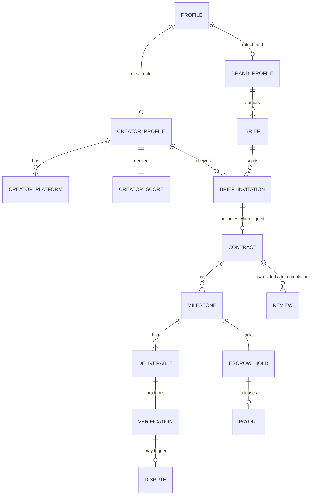
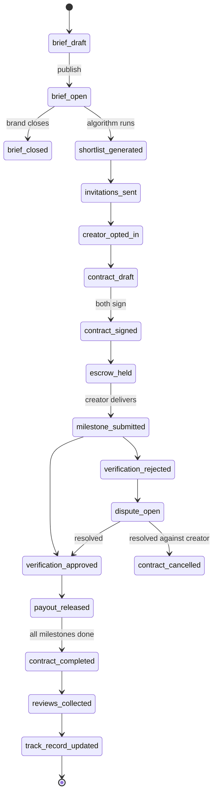

# Zentron Solutions — Domain Model

Canonical entities, terminology, and lifecycle states. Use these names verbatim in code, UI copy, and DB columns.

## Vocabulary rules

- `brief` not "job", "campaign request", or "RFP"
- `creator` not "influencer" (unless quoting the industry)
- `campaign` is what a signed `brief` becomes after a `contract` is in place
- `score` always means Zentron Score, never engagement rate
- `milestone` is the unit of escrow release
- `deliverable` is the unit of work submitted against a milestone
- `verification` is the act of confirming a deliverable; outcomes are `approved` or `rejected`
- `payout` is creator-side; `charge` / `refund` is brand-side
- `dispute` is filed against a rejected verification
- `referral` rewards both referrer and referee on the first paid collab

---

## Core entities

### `profile`

The user account. One per `auth.users` row.

| Field | Type | Notes |
|---|---|---|
| `id` | uuid | FK to `auth.users.id` |
| `role` | enum | `brand` \| `creator` \| `admin` |
| `display_name` | text | – |
| `avatar_url` | text | – |
| `country` | text (ISO 3166-1 alpha-2) | – |

### `brand_profile`

1:1 with `profile` where `role='brand'`.

| Field | Type | Notes |
|---|---|---|
| `company_name` | text | – |
| `website` | text | – |
| `industry` | text | – |
| `team_size` | enum | `1-10` \| `11-50` \| `51-200` \| `200+` |
| `logo_url` | text | – |
| `billing_country` | text | Used for VAT + Stripe |
| `subscription_tier` | enum | `free` \| `scale` (default `free`) |

### `creator_profile`

1:1 with `profile` where `role='creator'`.

| Field | Type | Notes |
|---|---|---|
| `handle` | text unique | Zentron handle (not platform handle) |
| `primary_platform` | enum | `instagram` \| `youtube` \| `tiktok` \| `podcast` \| `twitter` \| `linkedin` |
| `niches` | text[] | `finance`, `b2b_tech`, `beauty`, `lifestyle`, etc. |
| `languages` | text[] | ISO 639-1 codes |
| `bio` | text | – |
| `base_rate_cents` | int | Creator-set floor |
| `currency` | text | ISO 4217 |

### `creator_platform`

Many per `creator_profile`. One row per platform the creator publishes on.

| Field | Type | Notes |
|---|---|---|
| `platform` | enum | Same enum as `primary_platform` |
| `handle` | text | Platform-side handle |
| `followers` | int | – |
| `avg_engagement_rate` | numeric | (likes + comments + saves + shares) / followers |
| `audience_health_score` | numeric | 0–100, derived from bot/inactive ratio |
| `verified` | bool | We confirmed ownership |

### `creator_score`

Computed nightly + on demand. See [`ZENTRON_SCORE.md`](ZENTRON_SCORE.md) for math.

| Field | Type | Notes |
|---|---|---|
| `audience_size_band` | enum | `nano` \| `micro` \| `mid` \| `macro` \| `mega` |
| `engagement_score` | int (0–100) | – |
| `niche_multiplier` | numeric | 1.0–3.0 |
| `platform_score` | int (0–100) | – |
| `track_record_score` | int (0–100) | – |
| `final_score` | int (0–100) | Weighted combination |
| `suggested_min_cents` | int | Lower bound of fair range |
| `suggested_max_cents` | int | Upper bound of fair range |
| `computed_at` | timestamptz | – |

### `brief`

Authored by a brand.

| Field | Type | Notes |
|---|---|---|
| `brand_id` | uuid | FK |
| `title` | text | – |
| `objective` | text | Awareness, conversion, content licensing, etc. |
| `target_audience` | jsonb | `{country[], age_range, interests[]}` |
| `niche` | text | – |
| `platforms` | text[] | – |
| `deliverables` | jsonb | `[{type, count, specs}]` |
| `budget_min_cents` | int | – |
| `budget_max_cents` | int | – |
| `currency` | text | – |
| `exclusivity` | text | – |
| `usage_rights` | text | – |
| `status` | enum | `draft` \| `open` \| `closed` |

### `brief_invitation`

Joins `brief` ↔ `creator_profile` after the matching algorithm runs.

| Field | Type | Notes |
|---|---|---|
| `brief_id` | uuid | – |
| `creator_id` | uuid | – |
| `match_score` | int (0–100) | – |
| `status` | enum | `invited` \| `opted_in` \| `declined` \| `expired` |
| `invited_at` | timestamptz | – |
| `responded_at` | timestamptz | – |

### `contract` (Phase 3)

Created when both parties sign.

| Field | Type | Notes |
|---|---|---|
| `brief_id` | uuid | – |
| `creator_id` | uuid | – |
| `fee_cents` | int | Total contract value |
| `currency` | text | – |
| `scope` | text | – |
| `exclusivity` | text | – |
| `usage_rights` | text | – |
| `status` | enum | `draft` \| `sent` \| `signed` \| `active` \| `completed` \| `cancelled` |
| `signed_brand_at` | timestamptz | – |
| `signed_creator_at` | timestamptz | – |

### `milestone` (Phase 4)

Per-contract release unit.

| Field | Type | Notes |
|---|---|---|
| `contract_id` | uuid | – |
| `sequence` | int | Order within contract |
| `title` | text | – |
| `amount_cents` | int | – |
| `due_at` | timestamptz | – |
| `status` | enum | `pending` \| `submitted` \| `approved` \| `rejected` \| `released` |

### `escrow_hold` (Phase 4)

Stripe-backed lock on funds. 1:1 with `milestone`.

| Field | Type | Notes |
|---|---|---|
| `milestone_id` | uuid | – |
| `stripe_payment_intent_id` | text | – |
| `held_at` | timestamptz | – |
| `released_at` | timestamptz | – |
| `refunded_at` | timestamptz | – |

### `payout` (Phase 4)

Stripe Connect transfer to creator.

| Field | Type | Notes |
|---|---|---|
| `escrow_hold_id` | uuid | – |
| `stripe_transfer_id` | text | – |
| `amount_cents` | int | – |
| `currency` | text | – |
| `released_at` | timestamptz | – |

### `dispute` (Phase 5)

Filed against a rejected verification.

| Field | Type | Notes |
|---|---|---|
| `milestone_id` | uuid | – |
| `opened_by` | enum | `brand` \| `creator` |
| `reason` | text | – |
| `status` | enum | `open` \| `under_review` \| `resolved_brand` \| `resolved_creator` \| `resolved_split` |
| `resolved_at` | timestamptz | – |

### `review` (Phase 5)

Two-sided after `contract.status='completed'`.

| Field | Type | Notes |
|---|---|---|
| `contract_id` | uuid | – |
| `author_role` | enum | `brand` \| `creator` |
| `rating` | int (1–5) | – |
| `on_time` | bool | – |
| `on_brief` | bool | – |
| `comment` | text | – |

---

## Lifecycle: brief → paid

---

## Naming conventions in code

- Tables: `snake_case`, plural (`briefs`, `creator_profiles`)
- Columns: `snake_case` (`budget_min_cents`, `signed_brand_at`)
- Enums: `snake_case` values (`opted_in`, `under_review`)
- TS types: `PascalCase` matching table name singular (`Brief`, `CreatorProfile`)
- TS enums / unions: `PascalCase` keys, snake_case literal values
- Money: always store as `_cents` integer, never floats
- Timestamps: always `_at` suffix, always `timestamptz`
- Foreign keys: `<entity>_id` suffix
